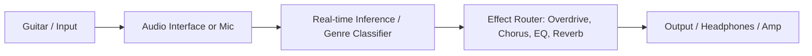

# AI Guitar Pedal — Real-time Genre-Aware FX

[](LICENSE)


**TL;DR:** Real-time, genre-aware guitar pedal — classifies input and routes tailored FX on the fly.

## 10-sec Demo (Headphones 🎧)
- Clean → Rock FX: [docs/audio/clean_rock_before.wav](docs/audio/clean_rock_before.wav) → [docs/audio/clean_rock_after.wav](docs/audio/clean_rock_after.wav)  
- Jazz Riff → Warmth/Chorus: [docs/audio/jazz_before.wav](docs/audio/jazz_before.wav) → [docs/audio/jazz_after.wav](docs/audio/jazz_after.wav)




```bash
pip install -r requirements.txt
python live_guitar_pedal.py  # set --device if needed


A Python-based, real-time guitar effects pedal powered by machine-learning genre classification.  
Supports two pipelines:

- **MLP** on hand-crafted audio features  
- **CNN** on log-mel spectrograms  

Can run **offline** on WAV files or **live** via any USB audio interface.

---

## 🚀 Quickstart

These commands assume you’re in the repository root (`AI_GUITAR_PEDAL/`) and have Python 3.9+ installed.

1. **Clone & install dependencies**  
   ```bash
   git clone https://github.com/<your-username>/AI_GUITAR_PEDAL.git
   cd AI_GUITAR_PEDAL
   python3 -m venv venv
   source venv/bin/activate
   pip install --upgrade pip
   pip install -r requirements.txt
   ```

2. **Download GTZAN dataset**  
   - From Kaggle:  
     https://www.kaggle.com/datasets/andradaolteanu/gtzan-dataset-music-genre-classification  
   - Unzip into `data/gtzan`, so you have e.g.  
     ```
     data/gtzan/blues/blues.00000.wav
     data/gtzan/classical/classical.00000.wav
     …
     ```

3. **Preprocess audio**  
   - Hand-crafted features (MLP):  
     ```bash
     python scripts/preprocess_audio.py features
     # → data/features.npy
     ```  
   - Log-mel spectrograms (CNN):  
     ```bash
     python scripts/preprocess_audio.py spectrogram
     # → data/specs.npz
     ```

4. **Train models**  
   - **MLP** on features:  
     ```bash
     python scripts/train_model.py --model-type mlp --data data/features.npy
     # → models/mlp_best.pth, models/mlp_last.pth, models/scaler.pkl
     ```  
   - **CNN** on spectrograms:  
     ```bash
     python scripts/train_model.py --model-type cnn --data data/specs.npz
     # → models/cnn_best.pth, models/cnn_last.pth
     ```

5. **Offline inference**  
   - **MLP** pipeline:  
     ```bash
     python main.py        --input data/gtzan/blues/blues.00000.wav        --output out_mlp.wav        --model models/mlp_best.pth        --scaler models/scaler.pkl
     ```  
   - **CNN** pipeline:  
     ```bash
     python main_cnn.py        --input data/gtzan/blues/blues.00000.wav        --output out_cnn.wav        --model models/cnn_best.pth
     ```

6. **Live pedal**  
   ```bash
   python live_guitar_pedal.py
   ```  
   Use `--device "<Your Audio Device Name>"` if you have multiple USB interfaces.

---

## 🗂️ Directory Structure

```
AI_GUITAR_PEDAL/
├── data/
│   ├── gtzan/             # GTZAN WAV files (download manually)
│   ├── features.npy       # Generated by preprocess_audio.py
│   └── specs.npz          # Generated by preprocess_audio.py
│
├── models/
│   ├── mlp_best.pth       # Best MLP checkpoint
│   ├── mlp_last.pth       # Last MLP checkpoint
│   ├── cnn_best.pth       # Best CNN checkpoint
│   ├── cnn_last.pth       # Last CNN checkpoint
│   └── scaler.pkl         # Feature scaler for MLP
│
├── scripts/
│   ├── effects.py         # Genre-specific FX chains
│   ├── preprocess_audio.py# Feature & spectrogram extraction
│   └── train_model.py     # MLP & CNN training routines
│
├── main.py                # Offline MLP inference + FX
├── main_cnn.py            # Offline CNN inference + FX
├── live_guitar_pedal.py   # Real-time audio FX loop
├── requirements.txt       # Python dependencies
└── README.md              # This file
```

---

## 🤝 Contributing

1. Fork the repository.  
2. Create a topic branch (`git checkout -b feat/YourFeature`)  
3. Commit your changes (`git commit -m "Add feature"`)  
4. Push and open a Pull Request.

Please follow project code style and update documentation/tests as needed.

---

## 📝 License

This project is licensed under the MIT License — see the `LICENSE` file for details.
